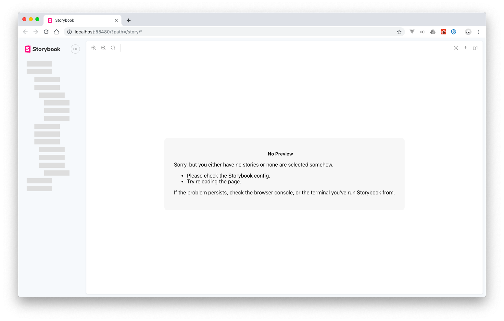

# Storybook

## Pre-requisites

- NodeJs

## Setup

### Setup Project

```bash
mkdir manual-storybook
cd manual-storybook
npm init -y
```

Outputs

```bash
$ npm init -y
Wrote to /path/to/manual-storybook/package.json:

{
  "name": "manual-storybook",
  "version": "1.0.0",
  "description": "",
  "main": "index.js",
  "scripts": {
    "test": "echo \"Error: no test specified\" && exit 1"
  },
  "keywords": [],
  "author": "",
  "license": "ISC"
}
```

### Install Dependencies

Install React

```bash
$ npm i react react-dom
npm notice created a lockfile as package-lock.json. You should commit this file.
npm WARN manual-storybook@1.0.0 No description
npm WARN manual-storybook@1.0.0 No repository field.

+ react@16.10.1
+ react-dom@16.10.1
added 8 packages from 3 contributors and audited 22 packages in 1.964s
found 0 vulnerabilities
```

Install Storybook as Dev Dependency

```bash
$ npm i -D @storybook/react

> fsevents@1.2.9 install /path/to/manual-storybook/node_modules/fsevents
> node install

node-pre-gyp WARN Using needle for node-pre-gyp https download 
[fsevents] Success: "/path/to/manual-storybook/node_modules/fsevents/lib/binding/Release/node-v64-darwin-x64/fse.node" is installed via remote

> core-js@2.6.9 postinstall /path/to/manual-storybook/node_modules/babel-runtime/node_modules/core-js
> node scripts/postinstall || echo "ignore"

Thank you for using core-js ( https://github.com/zloirock/core-js ) for polyfilling JavaScript standard library!

The project needs your help! Please consider supporting of core-js on Open Collective or Patreon: 
> https://opencollective.com/core-js 
> https://www.patreon.com/zloirock 

Also, the author of core-js ( https://github.com/zloirock ) is looking for a good job -)


> core-js@3.2.1 postinstall /path/to/manual-storybook/node_modules/core-js
> node scripts/postinstall || echo "ignore"

Thank you for using core-js ( https://github.com/zloirock/core-js ) for polyfilling JavaScript standard library!

The project needs your help! Please consider supporting of core-js on Open Collective or Patreon: 
> https://opencollective.com/core-js 
> https://www.patreon.com/zloirock 

Also, the author of core-js ( https://github.com/zloirock ) is looking for a good job -)


> core-js-pure@3.2.1 postinstall /path/to/manual-storybook/node_modules/core-js-pure
> node scripts/postinstall || echo "ignore"

Thank you for using core-js ( https://github.com/zloirock/core-js ) for polyfilling JavaScript standard library!

The project needs your help! Please consider supporting of core-js on Open Collective or Patreon: 
> https://opencollective.com/core-js 
> https://www.patreon.com/zloirock 

Also, the author of core-js ( https://github.com/zloirock ) is looking for a good job -)

npm WARN @storybook/react@5.2.1 requires a peer of babel-loader@^7.0.0 || ^8.0.0 but none is installed. You must install peer dependencies yourself.
npm WARN @storybook/core@5.2.1 requires a peer of babel-loader@^7.0.0 || ^8.0.0 but none is installed. You must install peer dependencies yourself.
npm WARN ts-pnp@1.1.4 requires a peer of typescript@* but none is installed. You must install peer dependencies yourself.
npm WARN manual-storybook@1.0.0 No description
npm WARN manual-storybook@1.0.0 No repository field.

+ @storybook/react@5.2.1
added 1145 packages from 880 contributors and audited 32998 packages in 70.849s
found 0 vulnerabilities
```

Install Peer Dependencies

```bash
npm i -D babel-loader @babel/core
```

Outputs

```bash
$ npm i -D babel-loader @babel/core
npm WARN ts-pnp@1.1.4 requires a peer of typescript@* but none is installed. You must install peer dependencies yourself.
npm WARN manual-storybook@1.0.0 No repository field.

+ @babel/core@7.6.2
+ babel-loader@8.0.6
added 2 packages from 1 contributor, updated 1 package and audited 33216 packages in 8.877s
found 0 vulnerabilities
```

Install TypeScript

```bash
$ npm i -D typescript
npm WARN manual-storybook@1.0.0 No repository field.

+ typescript@3.6.3
added 1 package from 1 contributor and audited 33217 packages in 9.409s
found 0 vulnerabilities
```

## Setup Script

In `package.json` add the following:

```json
{
  "scripts": {
    "storybook": "start-storybook"
  }
}
```

Run the script

```bash
npm run storybook
```

An error is show in the output:

```bash
$ npm run storybook

> manual-storybook@1.0.0 storybook /Users/stormwild/Source/storybook/manual-storybook
> start-storybook

info @storybook/react v5.2.1
info 
info => Loading presets
info => Loading presets

WARN Broken build, fix the error below.
WARN You may need to refresh the browser.

ERR! Error: => Create a storybook config file in "./.storybook/config.{ext}".
ERR!     at createPreviewEntry (/Users/stormwild/Source/storybook/manual-storybook/node_modules/@storybook/core/dist/server/preview/entries.js:21:11)
ERR!     at process._tickCallback (internal/process/next_tick.js:68:7)
ERR!     at Function.Module.runMain (internal/modules/cjs/loader.js:834:11)
ERR!     at startup (internal/bootstrap/node.js:283:19)
ERR!     at bootstrapNodeJSCore (internal/bootstrap/node.js:622:3)
ERR!  { Error: => Create a storybook config file in "./.storybook/config.{ext}".
ERR!     at createPreviewEntry (/path/to/manual-storybook/node_modules/@storybook/core/dist/server/preview/entries.js:21:11)
ERR!     at process._tickCallback (internal/process/next_tick.js:68:7)
ERR!     at Function.Module.runMain (internal/modules/cjs/loader.js:834:11)
ERR!     at startup (internal/bootstrap/node.js:283:19)
ERR!     at bootstrapNodeJSCore (internal/bootstrap/node.js:622:3)
ERR!   stack:
ERR!    'Error: => Create a storybook config file in "./.storybook/config.{ext}".\n    at createPreviewEntry (/path/to/manual-storybook/node_modules/@storybook/core/dist/server/preview/entries.js:21:11)\n    at process._tickCallback (internal/process/next_tick.js:68:7)\n    at Function.Module.runMain (internal/modules/cjs/loader.js:834:11)\n    at startup (internal/bootstrap/node.js:283:19)\n    at bootstrapNodeJSCore (internal/bootstrap/node.js:622:3)' }
```

The error indicates that storybook requires a `./.storybook/config.js` within the project or root directory.

To resolve the error complete the following steps:

- Create a folder called `.storybook`
- Create a file called `config.js` within the folder

The config file should contain the following:

```js
import { configure } from '@storybook/react';

function loadStories() {
  const req = require.context('../stories', true, /\.stories\.js$/);
  req.keys().forEach(filename => req(filename));
}

configure(loadStories, module);

```

- Create a folder called `stories` within the project or root directory

Run the command again:

```bash
$ npm run storybook

> manual-storybook@1.0.0 storybook /path/to/manual-storybook
> start-storybook

info @storybook/react v5.2.1
info 
info => Loading presets
info => Loading presets
info => Using default Webpack setup.
info => Using base config because react-scripts is not installed.
webpack built 462198e5d4447b7eede8 in 7362ms
╭──────────────────────────────────────────────────────╮
│                                                      │
│   Storybook 5.2.1 started                            │
│   9.99 s for manager and 9.48 s for preview          │
│                                                      │
│   Local:            http://localhost:55480/          │
│   On your network:  http://192.168.254.100:55480/    │
│                                                      │
╰──────────────────────────────────────────────────────╯


```

Storybook launches a browser window as shown below:




## References

- [Storybook: Getting Started](https://app.pluralsight.com/library/courses/storybook-getting-started/table-of-contents)